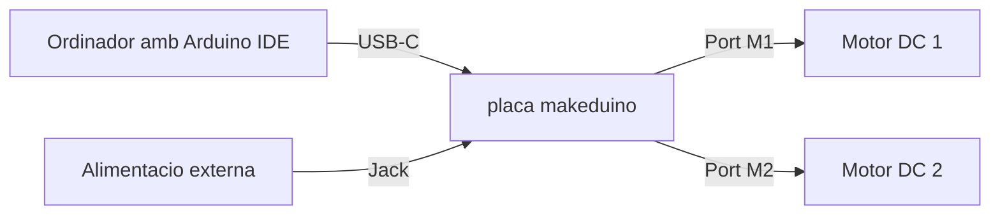

# makeduinoDCMotor

Llibreria Arduino per controlar dos motors DC amb la placa **makeduino**, basada en **Arduino UNO R4 Minima**.

Esta pensada per a alumnes que comencen amb programacio, electronica i robotica. Permet controlar la velocitat, el sentit de gir i el temps de funcionament dels motors amb instruccions senzilles.

## Que necessites

- Una placa makeduino.
- Arduino IDE instal.lat.
- La placa seleccionada com a `Arduino UNO R4 Minima`.
- Un cable USB-C.
- Un o dos motors DC connectats als ports `M1` i/o `M2`.

## Descarregar la llibreria des de GitHub

1. Entra al repositori:
   [https://github.com/MakeAndLearn/makeduinoDCMotor](https://github.com/MakeAndLearn/makeduinoDCMotor)
2. Prem el boto verd `Code`.
3. Tria `Download ZIP`.
4. Guarda el fitxer `.zip` al teu ordinador.

No cal descomprimir el fitxer per instal.lar-lo a Arduino IDE.

## Instal.lar la llibreria a Arduino IDE

1. Obre Arduino IDE.
2. Ves a `Sketch > Include Library > Add .ZIP Library...`.
3. Selecciona el fitxer `.zip` que has descarregat de GitHub.
4. Espera que Arduino IDE indiqui que la llibreria s'ha afegit correctament.

Despres d'instal.lar-la, els exemples apareixen a:

`File > Examples > makeduinoDCMotor`

## Seleccionar la placa

Abans de carregar un programa:

1. Connecta la placa makeduino amb el cable USB-C.
2. A Arduino IDE, ves a `Tools > Board`.
3. Selecciona `Arduino UNO R4 Minima`.
4. A `Tools > Port`, selecciona el port de la placa.

## Primer programa

Aquest programa encen el motor `M1` al 50% durant 2 segons i despres l'atura.

```cpp
#include <makeduinoDCMotor.h>

makeduinoDCMotor motor;

void setup() {
  motor.motorTurnOn("M1", 50);
  delay(2000);
  motor.motorTurnOff("M1");
}

void loop() {
}
```

## Motors

La placa te dos ports per a motors DC:

| Motor | Pins utilitzats | Us |
| --- | --- | --- |
| `M1` | 10 i 12 | Motor 1 |
| `M2` | 11 i 13 | Motor 2 |

Els pins `10` i `11` s'utilitzen per controlar la velocitat amb PWM. Els pins `12` i `13` s'utilitzen per controlar el sentit de gir.

## Velocitat i sentit de gir

La velocitat va de `-100` a `100`.

| Valor | Resultat |
| --- | --- |
| `100` | Maxima velocitat endavant |
| `50` | Mitja velocitat endavant |
| `0` | Motor aturat |
| `-50` | Mitja velocitat enrere |
| `-100` | Maxima velocitat enrere |

Si poses una velocitat fora d'aquest rang, la llibreria la limita automaticament.

## Funcions principals

| Funcio | Que fa |
| --- | --- |
| `motor.motorTurnOn("M1")` | Encen `M1` al 100%. |
| `motor.motorTurnOn("M1", 50)` | Encen `M1` al 50%. |
| `motor.motorTurnOn("M1", -50)` | Encen `M1` al 50% enrere. |
| `motor.motorTurnOn("M1", 50, 2000)` | Encen `M1` durant 2 segons i l'atura. |
| `motor.motorTurnOff("M1")` | Atura `M1`. |
| `motor.motorTurnOffAll()` | Atura tots els motors. |

## Exemples inclosos

Obre'ls des d'Arduino IDE a `File > Examples > makeduinoDCMotor`.

- `motorBasic`: encendre, aturar i canviar el sentit d'un motor.
- `twoMotors`: controlar `M1` i `M2` en una sequencia.
- `speedRamp`: pujar i baixar la velocitat a poc a poc.
- `robotMovements`: moviments basics amb dos motors, com avancar i girar.

## Esquema basic de connexio



## Informacio tecnica de la placa makeduino

La placa makeduino es una controladora electronica basada en un microcontrolador **Arm Cortex-M4 de 32 bits**. Esta dissenyada per desenvolupar projectes de programacio, electronica i robotica.

Caracteristiques principals:

- Connectors GVS digitals als pins `0` a `13`.
- Connectors GVS analogics als pins `A0` a `A5`.
- Dos ports per a motors DC: `M1` i `M2`.
- Connector USB-C per programar i/o alimentar la placa.
- Connector jack per alimentacio externa.
- Interruptor `ON/OFF`.
- Pins de comunicacio `I2C`: `SDA` i `SCL`.
- Connector `I2C` de 4 pins.
- Modul Bluetooth amb selector de mode `AT / BT`.
- Boto `RESET`.
- Capcaleres femella compatibles amb el format Arduino.

Dades mecaniques:

| Caracteristica | Valor |
| --- | --- |
| Dimensions | 71 x 54 x 15 mm |
| Pes | 27,4 g |

## Parts principals de la placa

1. Port USB-C.
2. Interruptor ON/OFF.
3. Connector jack d'alimentacio externa.
4. Port de motor `M1`.
5. Port de motor `M2`.
6. Bloc de connectors GVS digitals.
7. Bloc de connectors GVS analogics.
8. Connector I2C de 4 pins.
9. Microcontrolador principal.
10. Modul Bluetooth amb selector de mode `AT / BT`.
11. Boto RESET.

## Notes importants

- Connecta els motors a la placa abans de carregar programes que els activin.
- Comenca provant velocitats baixes, com `30` o `40`.
- Si fas servir motors, pot ser necessari alimentar la placa amb el connector jack extern.
- La funcio amb temps, per exemple `motorTurnOn("M1", 50, 2000)`, usa `delay()`. Durant aquest temps el programa espera i no fa altres accions.
- Si un motor gira al reves del que esperaves, pots canviar el signe de la velocitat: `50` passa a `-50`.

## Compatibilitat comprovada

Aquesta llibreria s'ha compilat correctament amb:

- Arduino CLI.
- Core `Arduino UNO R4 Boards`.
- Placa `Arduino UNO R4 Minima`.
